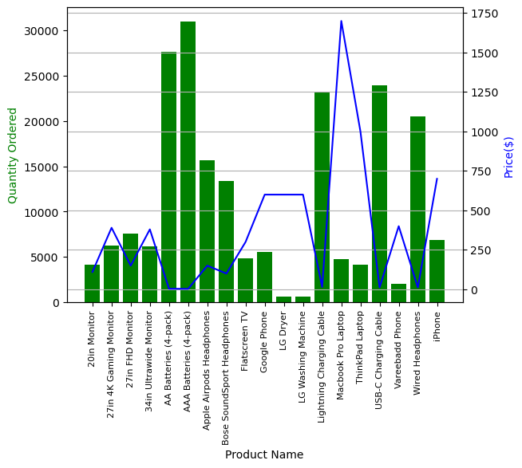

# Sales-Analysis-Using-Python
This GitHub repository contains the source code and resources for the Sales Analysis project.

## Table Of Contents

- [Project Overview](#project-overview)
- [Data Source](#data-source)
- [Python Libraries Used](#python-libraries-used)
- [Data Cleaning/Preparation](#data-cleaningpreparation)
- [Data Exploration](#data-exploration)
- [Results/Findings](#resultsfindings)
- [References](#references)

### Project Overview
This data analysis project aims to provide insights into the sales performance of an electronics store over the past months. Python's Pandas and Matplotlib libraries are utilized to analyze and answer business questions based on 12 months of sales data. The dataset contains detailed information about hundreds of thousands of electronics store purchases, including month, product type, cost, purchase address, etc.

---

---

### Data Source
Sales Data: The primary dataset used for this analysis is the "Merge_data.csv" file, which contains comprehensive information about each sale made by the company over several months.

### Python Libraries Used
- OS Library: Utilized for merging 12 months of sales data
- Pandas: Employed for data cleaning and analysis
- Matplotlib: Used for data visualization

### Data Cleaning/Preparation
In the initial data preparation phase, the following tasks were performed:

- Merging 12 months of sales data into one file using Python's OS library
- Dropping NaN values from the DataFrame
- Removing headers which are added multiple times while merging monthly data
- Eliminating duplicates
- Changing the type of columns (to_numeric, to_datetime, astype) for consistency and analysis

### Data Exploration
We explore five high-level business questions related to our data:

1. What was the best month for sales? How much revenue was generated during that month?
2. Which city sold the most products?
3. What is the optimal time to display advertisements to maximize the likelihood of customers making a purchase?
4. Which products are most frequently sold together?
5. Which product sold the most? What factors might have contributed to its high sales?

To answer these questions, we employ various Pandas and Matplotlib methods, including:

- Concatenating multiple CSVs to create a new DataFrame (pd.concat)
- Adding columns
- Parsing cells as strings to create new columns (.str)
- Utilizing the .apply() method
- Using groupby for aggregate analysis
- Visualizing results with bar charts and line graphs
- Labeling graphs for clarity

### Results/Findings
The analysis yields the following insights:

1. December had the highest sales, totaling $4,613,443.34, while January had the lowest sales at $1,822,256.73. 
2. San Francisco was the top-selling city, generating $8,262,203.91 in sales, while Portland (ME) had the lowest sales at $449,758.27.
3. The recommended times for displaying advertisements to maximize purchases are around 12 PM (noon) or 7 PM.
4. The products most often sold together are 'Lightning Charging Cable' and 'iPhone', with a count of 523.
5. Most Product Sold is AAA Batteries(4-pack)
- Price of Most Product Sold is AAA Batteries(4-pack) was low as compared to other products but based on the graph, we can infer that price alone does not directly determine the quantity ordered.
- Other factors, such as product demand, marketing strategies, and consumer preferences, likely influence the purchasing.

### References

1. [Python Documentation](https://pandas.pydata.org/docs/)
2. [Stack Overflow](https://stackoverflow.com/)
